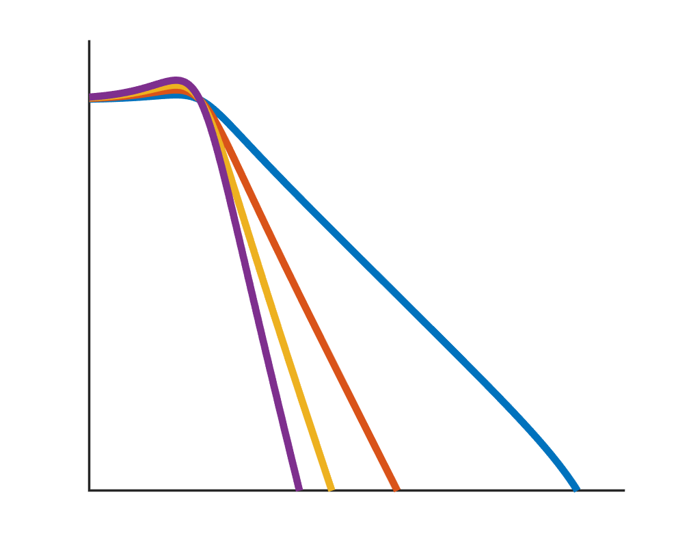
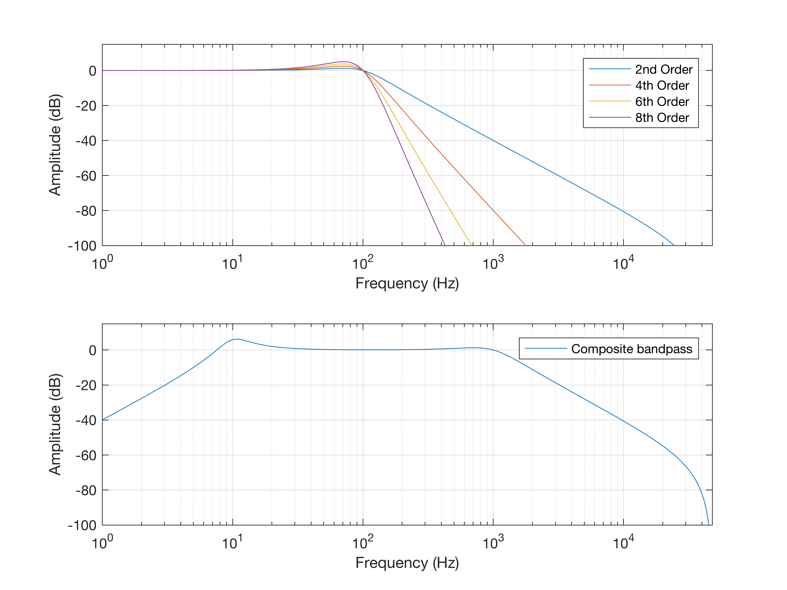

# coderFilter
A MATLAB Coder compatible filter function, capable of 2nd order high, low, and bandpass filters and their combinations.

## Motivation

I often use MATLAB coder to speed up simulations. A generic filtering function can be useful in these simulations, but MATLAB's filter design functions (specifically `butter()`) do not support code generation. For this reason I built my own quick-and-easy 2nd order, cascadable filter.

## Limitations

1. Only designed for 1D signals.
2. Not all filters possible with a biquad are included, only high/low/bandpass.

## Usage

    coderFilter(x, fs, fc, Q, type)

Input signal `x` and it's sample rate `fs` form the first two arguments of the filter, followed by the cutoff frequency `fc` in hertz, `Q` and the type of filter (`'high','low','band'`).

To cascade multiple 2nd order sections, simply add additional entries to the arguments `fc`, `Q`, and `type`. These must each be the same length.

## Example filter responses

The following amplitude responses were generated with the testbench file `coderFilter_testbench.mat`. The first plot shows the cascading of several 2nd order sections, performed within `coderFilter()` using `cascadeSSM()`. The second is a bandpass filter consisting of a highpass filter at 10 Hz and a lowpass filter at 1 kHz, both with different Q values.

